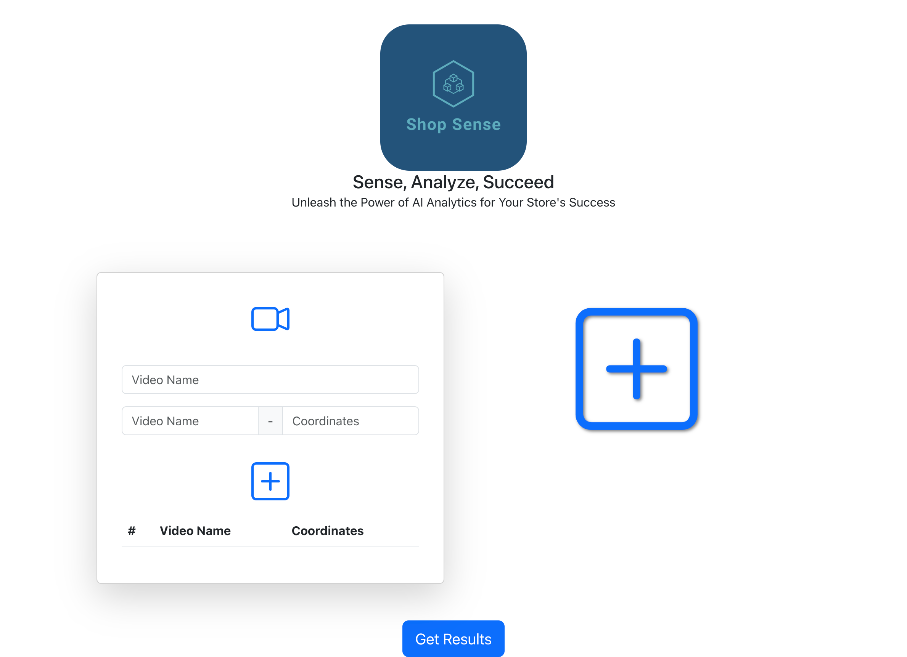
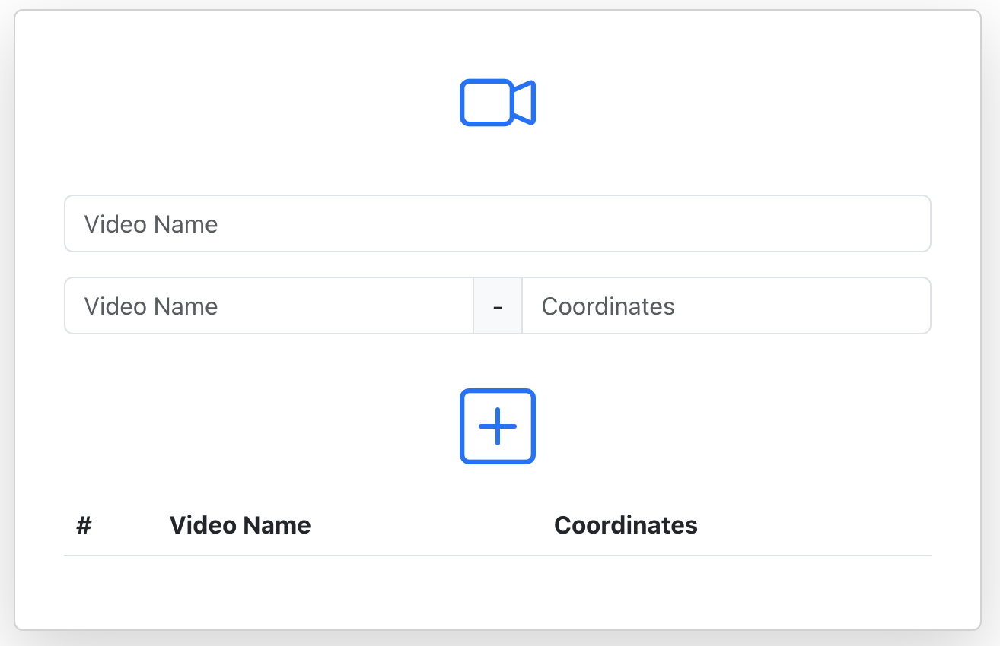
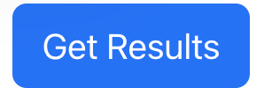

# SHOP SENSE WEB - CLIENT SIDE

## ABOUT

This project was bootstrapped with [Create React App](https://github.com/facebook/create-react-app).

Welcome to our Client Side README for the Client-Server System! In this document, we'll guide you through the user interface and functionality of the client-side application.

Our client-side application simplifies the process of collecting and annotating videos for your store's surveillance system.

<div style="display: flex; justify-content: center; align-items: center;">
  
</div>

## HOW TO WORK WITH THE APP

### User Interface

#### Video Upload and Data Form

- **Video Upload**: To get started, you'll find a form that allows you to upload a video of the front of your store. Click the "Video Logo" button to select the video file from your device.

- **Video Name**: After uploading the video, enter its name in the provided field.

- **Overlapping Video**: If you have another video with overlapping content, you can add its name and specify the coordinates of the overlap in the form.

  **Note:** When you are uploading the front camera remember to insert the door coordinates first.

- **Add Camera**: To include more cameras with overlapping videos, simply click the plus (+) logo. This action will reveal additional fields for you to add another camera and its overlapping video details.
<div style="display: flex; justify-content: center; align-items: center;">
  
</div>

#### Adding New Forms

- **Add Form**: Located next to the video form, you'll find a prominent plus (+) sign. Clicking it will open a new form, allowing you to add more video details for a different location.

<div style="display: flex; justify-content: center; align-items: center;">
  
</div>

#### Submission

- **Get Results**: Once you've completed the necessary video uploads, click the "Get Results" button at the end of the form. This action will send your data to the server for processing.
<div style="display: flex; justify-content: center; align-items: center;">
  
</div>

### Conclusion

After submitting your data, the server will analyis the data and return:

1. The videos with bounding boxes.
2. A graph showing how many people were in the store in each period of time.
3. Information about the number of people present in the shop and the AVG duration time.
4. The duration of time each person spent inside.

If you have any questions or encounter issues, please don't hesitate to contact our support team. Thank you for using our client-side system!

## Usage

To work on this project locally, follow these steps:

1. Clone the Git repository:

   ```bash
   git clone https://github.com/AvrahamOmer/shop-sense-web
   ```

2. Navigate to the project directory:

   ```bash
   cd SHOP-SENSE-WEB
   ```

3. Install project dependencies:

   ```bash
   npm install
   ```

4. Start the development server:

   ```bash
   npm start
   ```

5. Go to the server side to start the server:
   [SHOP-SENSE-SERVER](https://github.com/AvrahamOmer/Shop-Sense)

---
